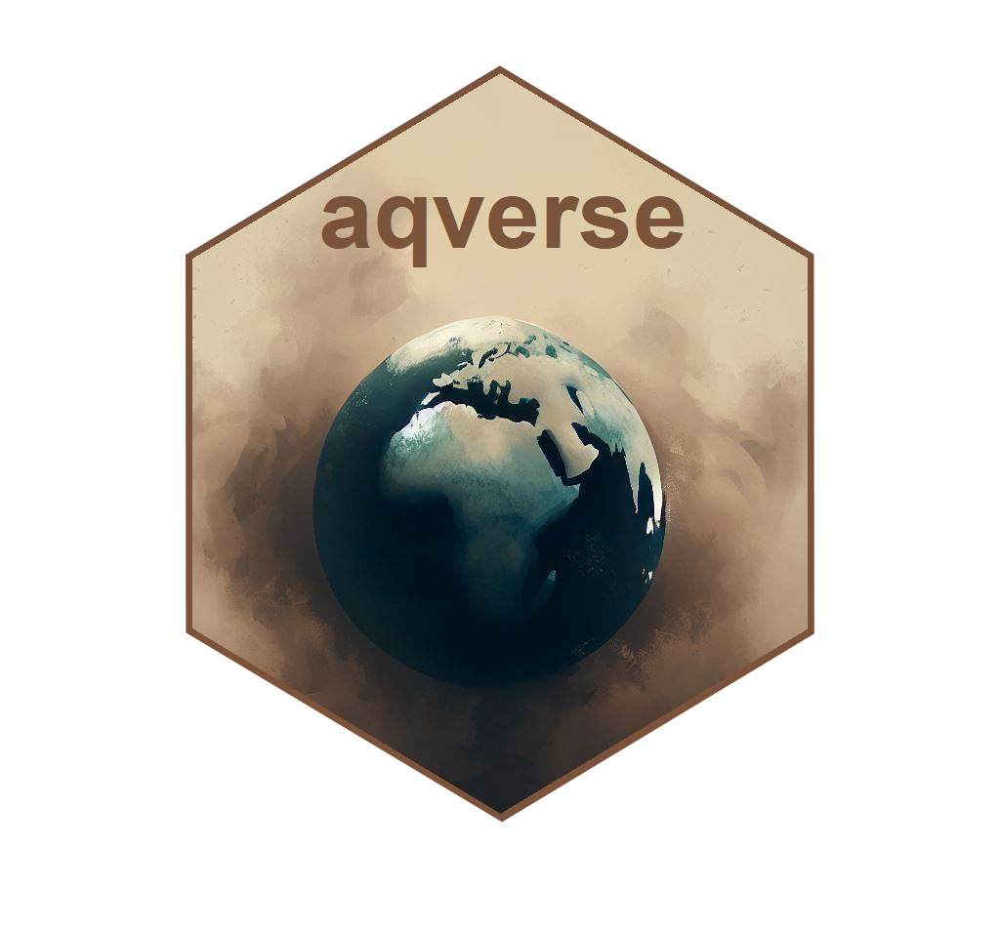

<!-- README.md is generated from README.Rmd. Please edit that file -->

```{r, include = FALSE}
knitr::opts_chunk$set(
  collapse = TRUE,
  comment = "#>",
  fig.path = "man/figures/README-",
  out.width = "100%"
)
```


# aqverse <a href="https://aqli.epic.uchicago.edu/the-index/"></a>

<!-- badges: start -->

<!-- badges: end -->

The goal of aqverse is to enable replication of our analysis that feeds into our reports, map and our website. Upcoming versions 
of this package will have all functionality inbuilt in our underlying satellite data processing pipeline and this will serve as
a meta-package for all other packages. 

## Installation

You can install the development version of aqverse from [GitHub](https://github.com/) with:

```{r}
# devtools::install_github("aqli-epic/aqverse")
```

## Load the package

Once installed, load the package into R as follows `library(aqverse)`

## Get the data

AQLI June 2022 report data can be downloaded from the AQLI website [index](https://aqli.epic.uchicago.edu/the-index/) page, or you could write to us at aqli-info@uchicago.edu. In the last quarter of 2023 AQLI will be releasing a new and updated version of this report.


## Functionality

This package in its current state contains a total of 8 functions and is under active development which allows you to do the following tasks:

 * Collapse AQLI district (gadm2) level pollution and life years lost datasets to gadm1 (state/province), gadm0 (country) and continent level.
 
 * Plot AQLI pollution and potential life expectancy gains maps for countries, states, districts (in AQLI color scale).
 
 * Do country level comparisons of life expectancy lost to PM2.5 with other threats to life expectancy (Global Burden of Disease).
 
 * Plot bar graphs for 'n' most/least polluted regions in a given country (in AQLI color scale).
 
 * Plot bar graphs with 'n' most/least life years lost to air pollution in a given country/state/continent (in AQLI color scale).
 
 * Plot distribution of pollution and life years lost in a given region.
 
 * Add standardized themes to AQLI plots
 
 * Plot timeseries plots for understanding pollution and life years lost trends.

